# 🏪 AI Inventory Tracker

> 📹 **Walkthrough Video:** _[Loom walkthrough coming soon — link will be added here]_

[](https://www.linkedin.com/in/dane-willms-3612a9281/)
[](https://github.com/Dane139)

A production-grade, real-time inventory management system built entirely on Azure. Sale events flow through a Service Bus queue into an Azure Function that decrements stock counts the moment a transaction is processed — no batch reconciliation, no manual counts. Every morning, a Logic App pulls 30 days of sales history, sends it to Azure OpenAI, and delivers actionable restock recommendations by email before the workday starts.

All infrastructure is provisioned as code using Terraform.

---

## The Business Problem

Small retailers and service businesses share a common and expensive problem: inventory decisions made on gut feel instead of data. They either run out of high-demand items at the worst possible moment, or tie up cash in slow-moving stock that sits on shelves.

The difference between reactive and predictive is enormous:

- **Reactive:** "You are running low on USB-C Hubs."
- **Predictive:** "Based on your sales over the last 30 days, you will run out of USB-C Hubs in 3 days. Order 7 units from Backup Supplier Inc before Thursday."

This project builds the predictive version.

---

## Architecture

```
┌─────────────────────────────────────────────────────────────────────┐
│                    rg-inventory-dane (East US)                      │
│                                                                     │
│  ┌─────────────┐    ┌──────────────────┐    ┌───────────────────┐  │
│  │  Web App    │    │  Service Bus     │    │  Function App     │  │
│  │  (Python)   │───▶│  Namespace       │───▶│  (Python 3.10)    │  │
│  │  B1 Linux   │    │  sale-events     │    │  process_sale.py  │  │
│  └─────────────┘    │  queue           │    └────────┬──────────┘  │
│                     └──────────────────┘             │             │
│  ┌─────────────┐                                     ▼             │
│  │  Key Vault  │◀────────────────────────────────────┤             │
│  │  (RBAC)     │                              ┌──────┴──────────┐  │
│  └─────────────┘                              │  Azure SQL DB   │  │
│                                               │  (West US 2)    │  │
│  ┌─────────────────────────────────────┐      │  InventoryDB    │  │
│  │  Logic App (Daily 6:00 AM ET)       │      │  Products       │  │
│  │  ┌──────────┐  ┌──────┐  ┌───────┐ │      │  Suppliers      │  │
│  │  │ SQL Query│─▶│  AI  │─▶│ Email │ │      │  StockMovements │  │
│  │  └──────────┘  └──────┘  └───────┘ │      └─────────────────┘  │
│  └─────────────────────────────────────┘                           │
│                                                                     │
│  ┌──────────────────┐    ┌─────────────────────────────────────┐   │
│  │  Azure OpenAI    │    │  Log Analytics Workspace            │   │
│  │  gpt-4.1-mini    │    │  (30-day retention)                 │   │
│  │  (East US)       │    └─────────────────────────────────────┘   │
│  └──────────────────┘                                              │
└─────────────────────────────────────────────────────────────────────┘
```

### Data Flow

```
Sale Occurs
    │
    ▼
Service Bus Queue (sale-events)
    │  Message safely stored — no data loss if app is restarting
    ▼
Azure Function (process_sale)
    │  Triggered automatically on each queue message
    ├─▶ UPDATE Products SET CurrentStock = CurrentStock - quantity
    └─▶ INSERT INTO StockMovements (audit trail)

Every Day at 6:00 AM ET
    │
    ▼
Logic App Trigger
    │
    ├─▶ SQL Query: 30-day sales by product + supplier info
    │
    ├─▶ Azure OpenAI (gpt-4.1-mini): generate restock recommendations
    │
    └─▶ Gmail: deliver clean recommendations email
```

---

## Why Service Bus?

The naive approach is to have the point-of-sale system call your inventory app directly. The problem: if the app is briefly unavailable (deploying, restarting, scaling), sale events are **lost** — and your stock counts silently drift out of sync.

Service Bus acts as a durable message buffer. The POS drops a message into the queue and gets immediate confirmation it's safely stored. The Function picks it up when ready — even if that's 30 seconds later. If processing fails, Service Bus retries automatically up to 3 times before moving the message to the dead-letter queue.

This is the pattern real production inventory systems use.

---

## Resources Deployed

| Resource | Type | Purpose |
|---|---|---|
| `rg-inventory-dane` | Resource Group | Container for all resources |
| `sqldb-dane-001` | Azure SQL Server | Database host (West US 2) |
| `InventoryDB` | SQL Database (Basic) | Products, Suppliers, StockMovements |
| `kv-inventory-dane` | Key Vault | Secrets storage (RBAC auth) |
| `sbns-inventory-dane` | Service Bus Namespace (Standard) | Message queuing |
| `sale-events` | Service Bus Queue | Sale event buffer |
| `asp-inventory-dane` | App Service Plan (B1 Linux) | Web app hosting |
| `app-inventory-dane` | Linux Web App (Python 3.11) | Inventory management UI |
| `asp-fn-inventory-dane` | App Service Plan (Y1 Linux) | Function consumption plan |
| `func-inventory-dane` | Linux Function App (Python 3.10) | Sale event processor |
| `stfninventorydane` | Storage Account (LRS) | Function runtime storage |
| `oai-inventory-dane` | Azure OpenAI (S0) | AI recommendations |
| `gpt-4.1-mini` | Cognitive Deployment | Language model |
| `la-restock-daily-dane` | Logic App | Daily analysis + email |
| `law-inventory-dane` | Log Analytics Workspace | Monitoring (30-day retention) |

---

## Prerequisites

- [Terraform](https://developer.hashicorp.com/terraform/downloads) installed
- [Azure CLI](https://learn.microsoft.com/en-us/cli/azure/install-azure-cli) installed and logged in
- Azure subscription (Pay-As-You-Go) with Azure OpenAI access
- Python 3.x installed locally

**Mac:**
```bash
brew install terraform azure-cli
az login
```

**Windows (PowerShell):**
```powershell
winget install HashiCorp.Terraform
winget install Microsoft.AzureCLI
az login
```

---

## Project Structure

```
inventory-tracker-001/
├── main.tf                    # All Azure resources
├── variables.tf               # Input variable definitions
├── outputs.tf                 # Resource outputs
├── terraform.tfvars           # Your values (not committed)
├── deploy_temp/               # Clean deployment package
│   ├── host.json              # Extension bundle config (required)
│   ├── requirements.txt       # Python dependencies
│   └── process_sale/
│       ├── function.json      # Service Bus trigger binding
│       └── process_sale.py    # Sale processing logic
└── send_message.py            # Test utility for Service Bus
```

---

## Deployment

### Step 1 — Configure variables

Create `terraform.tfvars`:

```hcl
yourname           = "dane"
location           = "East US"
sql_admin_login    = "sqladmin"
sql_admin_password = "YourSecureP@ssw0rd!"
alert_email        = "your.email@example.com"
```

> ⚠️ Never commit `terraform.tfvars` to source control — it contains credentials.

### Step 2 — Deploy infrastructure

```bash
terraform init
terraform plan
terraform apply -auto-approve
```

Expect ~23 resources. Deployment takes 8–12 minutes due to SQL and Service Bus provisioning.

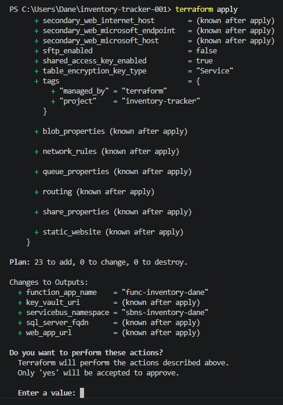

### Step 3 — Create the database schema

In the portal: navigate to **InventoryDB → Query editor**, log in with your SQL credentials, and run these three blocks in order.

**Block 1 — Create tables:**
```sql
CREATE TABLE Products (
    ProductId    INT IDENTITY(1,1) PRIMARY KEY,
    ProductName  NVARCHAR(200) NOT NULL,
    SKU          NVARCHAR(50) UNIQUE,
    CurrentStock INT DEFAULT 0,
    MinimumStock INT DEFAULT 10,
    UnitCost     DECIMAL(10,2),
    SupplierId   INT,
    LastSaleDate DATETIME2,
    CreatedAt    DATETIME2 DEFAULT GETUTCDATE()
);

CREATE TABLE Suppliers (
    SupplierId   INT IDENTITY(1,1) PRIMARY KEY,
    SupplierName NVARCHAR(200) NOT NULL,
    ContactEmail NVARCHAR(200),
    LeadTimeDays INT DEFAULT 3
);

CREATE TABLE StockMovements (
    MovementId   INT IDENTITY(1,1) PRIMARY KEY,
    ProductId    INT REFERENCES Products(ProductId),
    MovementType NVARCHAR(20),
    Quantity     INT NOT NULL,
    Reference    NVARCHAR(100),
    MovedAt      DATETIME2 DEFAULT GETUTCDATE()
);
```

**Block 2 — Seed test data:**
```sql
INSERT INTO Suppliers (SupplierName, ContactEmail, LeadTimeDays)
VALUES ('Primary Supplier Co', 'orders@supplier.com', 3),
       ('Backup Supplier Inc', 'supply@backup.com', 7);

INSERT INTO Products (ProductName, SKU, CurrentStock, MinimumStock, UnitCost, SupplierId)
VALUES ('Laptop',         'LAP-001', 15, 5, 899.99, 1),
       ('Wireless Mouse', 'MSE-001', 8,  10, 29.99, 1),
       ('USB-C Hub',      'HUB-001', 3,  10, 49.99, 2),
       ('Monitor',        'MON-001', 12, 5, 299.99, 1),
       ('Keyboard',       'KEY-001', 20, 8, 79.99,  1);
```

**Block 3 — Verify:**
```sql
SELECT p.ProductName, p.CurrentStock, p.MinimumStock, s.SupplierName
FROM Products p
JOIN Suppliers s ON p.SupplierId = s.SupplierId;
```

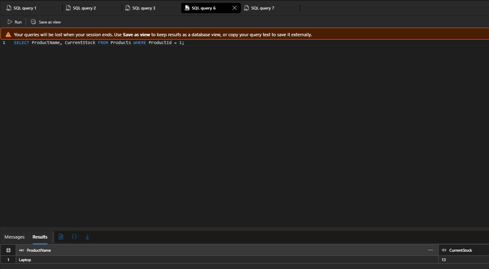

### Step 4 — Add Function App settings

The Function uses individual SQL credentials instead of a connection string (see Troubleshooting — pyodbc vs pymssql):

```powershell
az functionapp config appsettings set `
  --name func-inventory-dane `
  --resource-group rg-inventory-dane `
  --settings `
    SQL_SERVER="sqldb-dane-001.database.windows.net" `
    SQL_DATABASE="InventoryDB" `
    SQL_USERNAME="sqladmin" `
    SQL_PASSWORD="YourPassword" `
    PYTHON_ENABLE_WORKER_EXTENSIONS=1
```

### Step 5 — Deploy the Function code

**Mac:**
```bash
cd deploy_temp
zip -r ../function_deploy.zip .
cd ..

az functionapp deployment source config-zip \
  --resource-group rg-inventory-dane \
  --name func-inventory-dane \
  --src function_deploy.zip \
  --build-remote true

az functionapp restart \
  --name func-inventory-dane \
  --resource-group rg-inventory-dane
```

**Windows (PowerShell):**
```powershell
cd deploy_temp
Compress-Archive -Path * -DestinationPath ..\function_deploy.zip -Force
cd ..

az functionapp deployment source config-zip `
  --resource-group rg-inventory-dane `
  --name func-inventory-dane `
  --src function_deploy.zip `
  --build-remote true

az functionapp restart `
  --name func-inventory-dane `
  --resource-group rg-inventory-dane
```

> The `--build-remote true` flag is required. It runs `pip install` on Azure's Linux build server, which has the native ODBC libraries needed to compile `pymssql`. Local Windows builds will fail.

Wait 2 minutes after restart before testing — the extension bundle needs time to download.

### Step 6 — Test the sale event pipeline

Install the test dependency:
```bash
pip install azure-servicebus
```

Get your Service Bus connection string:

**Mac:**
```bash
CONN=$(az servicebus namespace authorization-rule keys list \
  --resource-group rg-inventory-dane \
  --namespace-name sbns-inventory-dane \
  --name RootManageSharedAccessKey \
  --query primaryConnectionString -o tsv)
```

**Windows (PowerShell):**
```powershell
$conn = az servicebus namespace authorization-rule keys list `
  --resource-group rg-inventory-dane `
  --namespace-name sbns-inventory-dane `
  --name RootManageSharedAccessKey `
  --query primaryConnectionString -o tsv
```

Send a test message:
```bash
python send_message.py $CONN   # Mac
python send_message.py $conn   # Windows
```

Wait 30 seconds, then verify in the SQL Query Editor:
```sql
SELECT ProductName, CurrentStock FROM Products WHERE ProductId = 1;
-- Laptop should show 13 (15 minus 2)

SELECT * FROM StockMovements ORDER BY MovedAt DESC;
-- Should show one SALE row with Reference = TEST-001
```


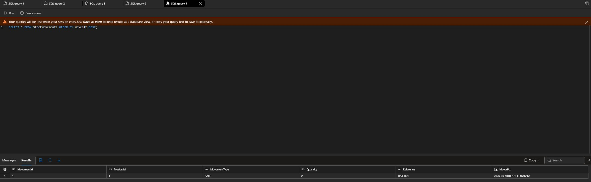

**Before the Function was working** — messages accumulating in the queue:

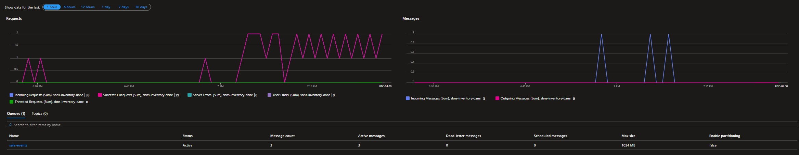

**After the fix** — queue draining successfully:

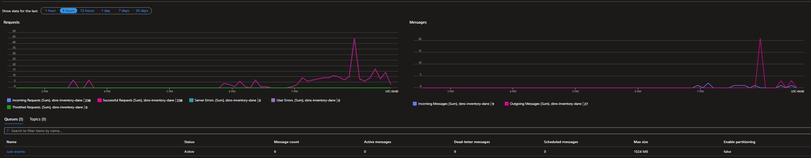

### Step 7 — Configure the Logic App

Navigate to **la-restock-daily-dane → Logic app designer** and build the following workflow:

1. **Recurrence trigger** — Interval: 1, Frequency: Day, Hour: 6, Timezone: Eastern Time
2. **SQL Server → Execute a SQL query (V2)** — connect to InventoryDB and run:

```sql
SELECT
    p.ProductName,
    p.CurrentStock,
    p.MinimumStock,
    p.UnitCost,
    s.SupplierName,
    s.LeadTimeDays,
    SUM(m.Quantity) AS UnitsSoldLast30Days
FROM Products p
JOIN Suppliers s ON p.SupplierId = s.SupplierId
LEFT JOIN StockMovements m
    ON p.ProductId = m.ProductId
    AND m.MovementType = 'SALE'
    AND m.MovedAt >= DATEADD(day, -30, GETUTCDATE())
GROUP BY p.ProductName, p.CurrentStock, p.MinimumStock, p.UnitCost,
         s.SupplierName, s.LeadTimeDays
ORDER BY p.CurrentStock ASC;
```

3. **HTTP** — POST to your OpenAI endpoint with the SQL results embedded in the prompt

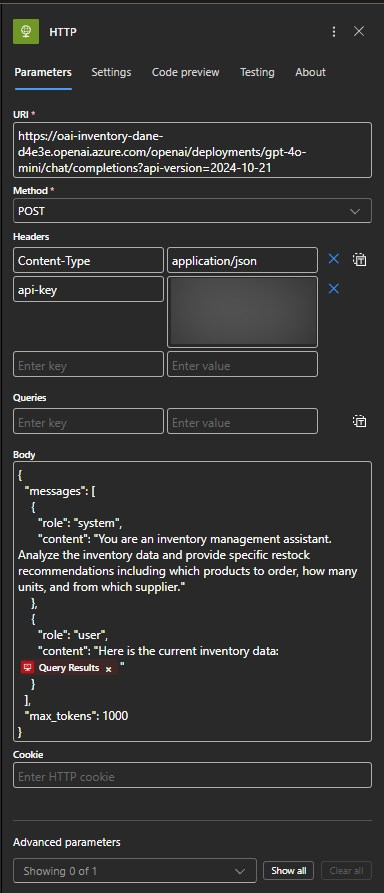

4. **Parse JSON** — extract `choices[0].message.content` from the OpenAI response

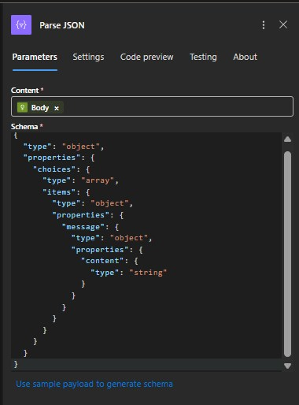

5. **Send email (Gmail/Outlook)** — deliver the clean recommendations text

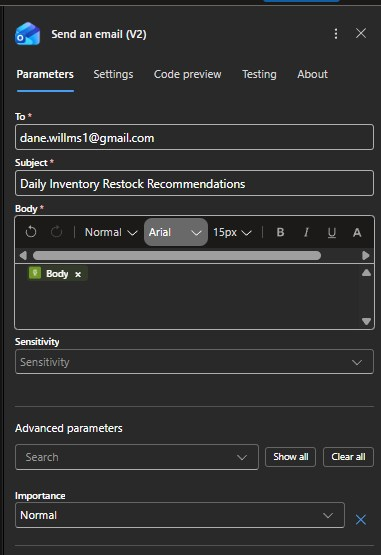

**Complete workflow:**

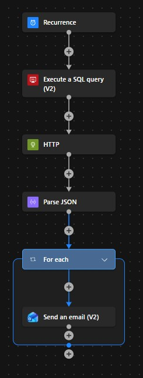

---

## Verification Checklist

- [ ] All three tables created in InventoryDB (Products, Suppliers, StockMovements)
- [ ] Five products and two suppliers seeded
- [ ] Service Bus namespace and `sale-events` queue visible in portal
- [ ] Function App `func-inventory-dane` shows **Running** status
- [ ] Test sale processed: Laptop stock dropped from 15 to 13
- [ ] StockMovements table contains the SALE audit record
- [ ] Logic App ran successfully and connected to SQL
- [ ] Email received with clean AI restock recommendations

---

## Screenshots

All screenshots are embedded throughout this README at the relevant steps. To set up the `assets/` folder in your repo, rename your files as follows:

| Original filename | Rename to |
|---|---|
| `Inventory_tracker-23_changes.jpg` | `assets/terraform-plan.jpg` |
| `sbns_inventory_message_queue.jpg` | `assets/servicebus-messages-accumulating.jpg` |
| `service_bus_page.jpg` | `assets/servicebus-processing-complete.jpg` |
| `current_stock_13.jpg` | `assets/stock-count-verified.jpg` |
| `order_update_moved_when.jpg` | `assets/stock-movements-audit.jpg` |
| `sql_query_LA.jpg` | `assets/logicapp-sql-connection.jpg` |
| `query_LA.jpg` | `assets/logicapp-sql-query.jpg` |
| `http_trigger_LA.jpg` | `assets/logicapp-http-openai.jpg` |
| `parse_json_LA.jpg` | `assets/logicapp-parse-json.jpg` |
| `Email_LA.jpg` | `assets/logicapp-email-step.jpg` |
| `final_LA_design.jpg` | `assets/logicapp-complete-workflow.jpg` |
| `original_email_run_.jpg` | `assets/email-raw-json.jpg` |
| `final_EMAIL_.jpg` | `assets/email-final-clean.jpg` |

---

## Troubleshooting

This project encountered 13 real infrastructure issues during deployment. All are documented here because they represent genuine production-equivalent problems.

### Issue 1 — Resource Group in Deprovisioning State (409 Conflict)

**Symptom:** `ResourceGroupBeingDeleted: The resource group is in deprovisioning state`

**Cause:** A previous `terraform destroy` ran incomplete. Azure locked the resource group while Terraform attempted a new `apply` into it.

**Fix:**
```bash
az group delete --name rg-inventory-dane --yes
# Wait for full deletion, then:
terraform apply -auto-approve
```

---

### Issue 2 — Terraform State Out of Sync (404 on Destroy)

**Symptom:** `terraform destroy` returns 404 — resource group not found, but state file still references it.

**Cause:** Resource was deleted outside of Terraform. State file is stale.

**Fix:**
```powershell
Remove-Item terraform.tfstate
Remove-Item terraform.tfstate.backup
terraform apply -auto-approve
```

---

### Issue 3 — Linux Consumption Plan Not Available in Region (400 Bad Request)

**Symptom:** `Requested features 'Dynamic SKU, Linux Worker' not available in resource group`

**Cause:** Central US had capacity restrictions on Linux consumption plans.

**Fix:** Changed `location` in `terraform.tfvars` to `East US`. Requested compute quota increase via portal → Quotas → App Service.

---

### Issue 4 — OpenAI Model Version Deprecated (400 Bad Request)

**Symptom:** `ServiceModelDeprecated: The model 'gpt-4o-mini, Version:2024-07-18' has been deprecated since 03/31/2026`

**Cause:** Lab guide was written before March 2026. Model version was hard-removed.

**Fix:** Switched to `gpt-4.1-mini` version `2024-10-18` in `main.tf`:

```hcl
model {
  format  = "OpenAI"
  name    = "gpt-4.1-mini"
  version = "2025-04-14"
}
```

Verify available versions in your region:
```bash
az cognitiveservices model list --location "eastus" \
  --query "[?model.name=='gpt-4.1-mini'].{Name:model.name,Version:model.version}" \
  -o table
```

---

### Issue 5 — App Service Plan VM Quota Zero (401 Unauthorized)

**Symptom:** `Operation cannot be completed without additional quota. Current Limit (Total VMs): 0`

**Cause:** New Pay-As-You-Go subscriptions have zero compute quota by default in most regions.

**Fix:** Portal → Quotas → App Service → East US → request increases for:
- Total Regional vCPUs → 20
- B1 VMs → 10
- S1 VMs → 10

Auto-approved within 15–30 minutes on PAYG accounts.

---

### Issue 6 — SQL Server Provisioning Disabled (ProvisioningDisabled)

**Symptom:** `Provisioning is restricted in this region. Please choose a different region.`

**Cause:** East US had SQL Server provisioning restricted on this subscription type.

**Fix:** Pinned the SQL Server to West US 2 explicitly in `main.tf`:

```hcl
resource "azurerm_mssql_server" "main" {
  location = "West US 2"   # Override — East US SQL is blocked on this subscription
  ...
}
```

> A resource group's location is just metadata. Resources inside it can live in different Azure regions.

---

### Issue 7 — SQL Server Name Reserved After Failed Deploy (409 Conflict)

**Symptom:** `InvalidResourceLocation: The resource 'sql-inventory-dane' already exists in location 'eastus'. Cannot create in westus2.`

**Cause:** Azure SQL Server names are globally unique and DNS-reserved. Deleting a server doesn't immediately free the name.

**Fix:** Renamed the SQL Server resource in `main.tf`:
```hcl
name = "sql-inv-${var.yourname}"   # was: sql-inventory-${var.yourname}
```

Also update the connection string in the Key Vault secret to match the new FQDN.

---

### Issue 8 — OpenAI Account Soft-Delete Conflict (409 FlagMustBeSetForRestore)

**Symptom:** `FlagMustBeSetForRestore: An existing resource has been soft-deleted. Specify 'restore' = true or purge it first.`

**Cause:** Azure Cognitive Services accounts use soft-delete. Terraform `destroy` moves the account to soft-deleted state, not hard-deleted.

**Fix (immediate):**
```bash
az cognitiveservices account purge \
  --name oai-inventory-dane \
  --resource-group rg-inventory-dane \
  --location "eastus"
```

**Fix (permanent):** Add to your provider block in `main.tf`:
```hcl
provider "azurerm" {
  features {
    cognitive_account {
      purge_soft_delete_on_destroy = true
    }
    resource_group {
      prevent_deletion_if_contains_resources = false
    }
  }
}
```

---

### Issue 9 — Key Vault Secrets Already Exist (Import Required)

**Symptom:** `A resource with this ID already exists — needs to be imported into State`

**Cause:** Secrets were created in a partial apply. State was wiped but secrets remain in Azure.

**Fix:**
```bash
terraform import azurerm_key_vault_secret.db_connection \
  "https://kv-inventory-dane.vault.azure.net/secrets/SqlConnectionString/<version-id>"
```

Repeat for each orphaned secret using the exact version ID from the error message.

---

### Issue 10 — Service Bus Trigger Not Registered

**Symptom:** `The binding type(s) 'serviceBusTrigger' are not registered. Please ensure the binding extension is installed.`

**Cause:** Python Function Apps using `function.json` bindings require an extension bundle declaration in `host.json`. Without it, the runtime doesn't know how to load the Service Bus trigger.

**Fix:** Add `host.json` to the deployment package root:

```json
{
  "version": "2.0",
  "extensionBundle": {
    "id": "Microsoft.Azure.Functions.ExtensionBundle",
    "version": "[3.*, 4.0.0)"
  }
}
```

The zip structure must be:
```
host.json
requirements.txt
process_sale/
  function.json
  process_sale.py
```

---

### Issue 11 — pyodbc ODBC Driver Not Available on Linux

**Symptom:** `[unixODBC][Driver Manager]Data source name not found and no default driver specified`

**Cause:** `pyodbc` requires the Microsoft ODBC Driver for SQL Server to be installed at the OS level. The Azure Functions Linux runtime does not include it, and `PYTHON_ENABLE_WORKER_EXTENSIONS=1` alone is insufficient.

**Fix:** Replace `pyodbc` with `pymssql`, which uses its own bundled TDS protocol implementation and requires no system ODBC drivers.

**requirements.txt:**
```
pymssql==2.3.1
azure-servicebus==7.11.4
```

**process_sale.py connection (key change):**
```python
# Old (pyodbc) — requires system ODBC driver, doesn't work on Linux Functions
conn = pyodbc.connect(os.environ["SqlConnectionString"])

# New (pymssql) — works natively on Linux
conn = pymssql.connect(
    os.environ["SQL_SERVER"],
    os.environ["SQL_USERNAME"],
    os.environ["SQL_PASSWORD"],
    os.environ["SQL_DATABASE"]
)
```

Also note: `pymssql` uses `%s` placeholders in SQL queries, not `?`:
```python
cursor.execute("UPDATE Products SET CurrentStock = CurrentStock - %s WHERE ProductId = %s",
               (quantity, product_id))
```

Deploy with `--build-remote true` so `pymssql` compiles on Azure's Linux build server:
```bash
az functionapp deployment source config-zip \
  --src function_deploy.zip \
  --build-remote true
```

---

### Issue 12 — Messages Accumulating, Function Not Processing

**Symptom:** Service Bus active message count climbing. Function registered but never fires.

**Cause:** The Service Bus listener stops immediately after startup when there's a binding registration failure. The `StopAsync` log entry is the signal.

**Diagnosis:**
```bash
az monitor app-insights query \
  --app func-inventory-dane \
  --resource-group rg-inventory-dane \
  --analytics-query "traces | where timestamp > ago(10m) | where severityLevel >= 2 | project timestamp, message | order by timestamp desc" \
  --offset 10m
```

**Fix:** Resolve the underlying binding error first (see Issue 10), then redeploy and restart.

---

### Issue 13 — Logic App Email Shows Raw JSON

**Symptom:** Email body contains the full OpenAI API response object instead of just the recommendation text.

**Before fix** — raw JSON response in email:

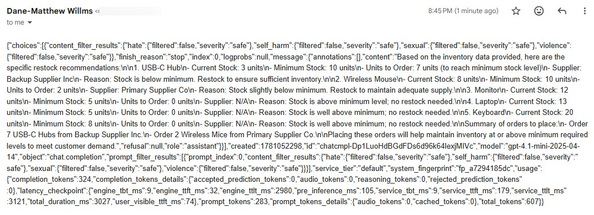

**After fix** — clean readable recommendations:

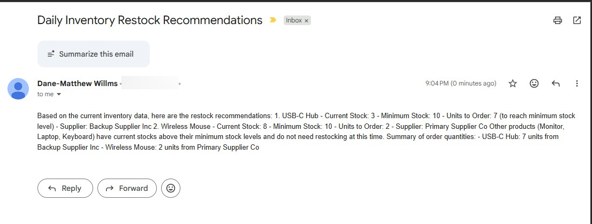

**Cause:** The HTTP action body token returns the entire JSON response. The actual recommendation text is nested at `choices[0].message.content`.

**Fix:** Add a **Parse JSON** step between HTTP and Send Email with this schema:

```json
{
  "type": "object",
  "properties": {
    "choices": {
      "type": "array",
      "items": {
        "type": "object",
        "properties": {
          "message": {
            "type": "object",
            "properties": {
              "content": { "type": "string" }
            }
          }
        }
      }
    }
  }
}
```

Use **Body content** from Parse JSON as the email body instead of the raw HTTP Body token.

---

## Key Concepts

| Concept | Why It Matters |
|---|---|
| **Service Bus decoupling** | POS system and inventory app can fail independently without losing sale events |
| **Dead-letter queue** | Messages that fail 3 times are quarantined for inspection, not silently dropped |
| **Lock duration (PT1M)** | Function has 1 minute to process a message before Service Bus releases it for retry |
| **Atomic SQL transactions** | Stock update + audit record are committed together — no partial writes |
| **Soft-delete on Cognitive Services** | Terraform `destroy` doesn't hard-delete OpenAI accounts. Always add `purge_soft_delete_on_destroy = true` in dev environments |
| **Extension bundle in host.json** | Required for `function.json`-style Python Functions to load non-HTTP triggers |
| **pymssql vs pyodbc** | `pyodbc` requires system ODBC drivers not available on Azure Functions Linux. `pymssql` bundles its own TDS driver |
| **Regional resource pinning** | Resource group location is metadata. SQL server and other resources can be deployed to different regions within the same RG |

---

## Teardown

```bash
terraform destroy -auto-approve
```

> Note: If destroy fails due to nested resources, add `prevent_deletion_if_contains_resources = false` to the `resource_group` block in your provider configuration.

---

## References

- [Azure Service Bus Documentation](https://learn.microsoft.com/en-us/azure/service-bus-messaging/)
- [Azure Functions Python Developer Guide](https://learn.microsoft.com/en-us/azure/azure-functions/functions-reference-python)
- [Azure OpenAI Service](https://learn.microsoft.com/en-us/azure/ai-services/openai/)
- [pymssql Documentation](https://pymssql.readthedocs.io/)
- [Terraform AzureRM Provider](https://registry.terraform.io/providers/hashicorp/azurerm/latest/docs)